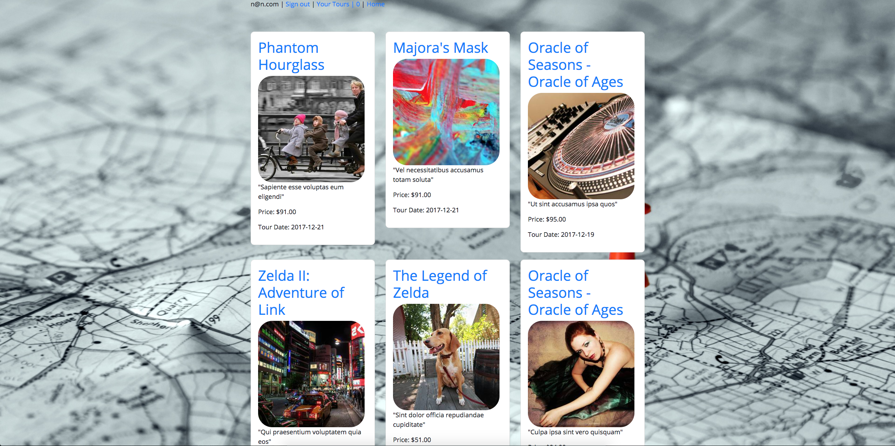

# Urban Sherpa

## By Noah Gottlieb

### About

 The ultimate goal of Urban Sherpa will be to match travelers with their own custom tour guide providing unique experiences around the world. In a foreign country where you don't speak the language but want to experience life of one of the locals? Use Urban Sherpa and pal around with one of our guides to show you his favorite bar or maybe sit down to dinner with our guides family and share in a cultural experience like no other!

### Setup

1. open terminal navigate to desired download location (ex. `cd desktop`) and enter:  `git clone https://github.com/ngottlieb87/Urban-Sherpa`

2. Navigate to the root of the project directory and enter the following commands in the terminal:
  * `bundle install`
  * `rake db:create`
  * `rake db:migrate`
  * `rake db:test:prepare`
  * `rake db:seed`

3. To launch the application type the command while in the root directory:
   `rails s`

4. Use your favorite browser and in the url type: `localhost:3000`

### Bugs
* None known at this time?....(fingers crossed)

### Upcoming Features
* Persistent Tour Itinerary
* CRUD for users to update tours
* User Profiles
* Tagging for sorting tours and guides
* Voting for tours by users and applicable for guides.
* Email Itinerary to Users and response

### Image
#### Urban Sherpa Home Page

### Technologies Used

###### _Rails, Ruby, ActiveRecord, PSQL, Sass/Bootstrap, Ajax_
